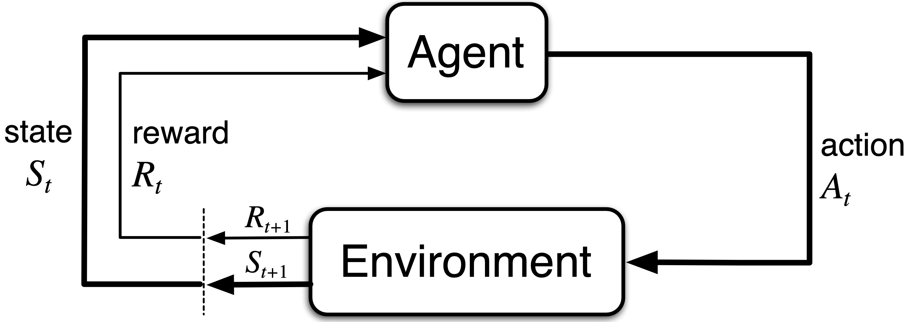
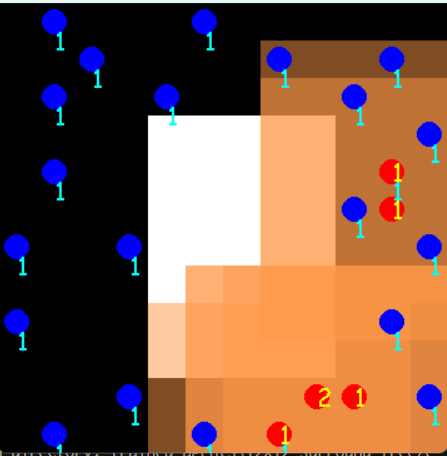
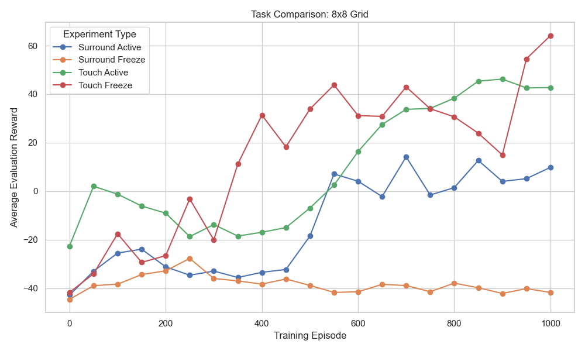
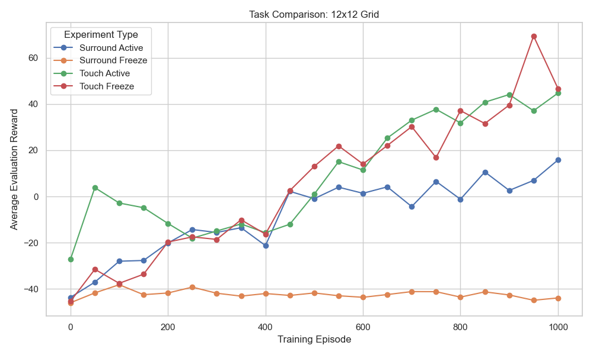
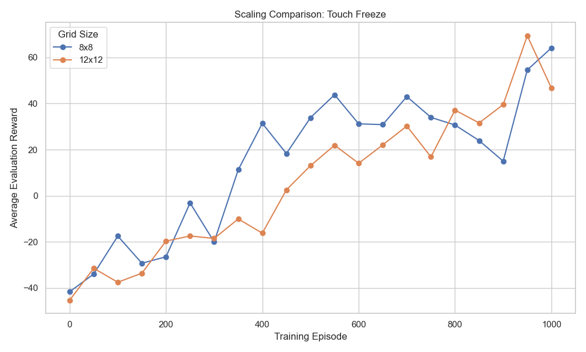

<!-- _class: title -->

# How Well Can Agents Hunt Together? A QMIX Pursuit Study

<br>

**Konstantin Bobenko**
Hasso Plattner Institute, University of Potsdam

---

# Agenda

<br>

**Background**
&nbsp;&nbsp;Motivation &nbsp;·&nbsp; Reinforcement Learning &nbsp;·&nbsp; Multi-Agent RL &nbsp;·&nbsp; The Pursuit Environment &nbsp;·&nbsp; MARL Challenges

**Methodology**
&nbsp;&nbsp;QMIX Architecture &nbsp;·&nbsp; Agent Networks &nbsp;·&nbsp; Hypernetworks & Monotonicity &nbsp;·&nbsp; CTDE &nbsp;·&nbsp; Training

**Results**
&nbsp;&nbsp;Task Comparison &nbsp;·&nbsp; Why Surround/Freeze Fails &nbsp;·&nbsp; Scaling

**Discussion**
&nbsp;&nbsp;Future Work

---

# Motivation

Imagine a group of people trying to catch someone in a park.
One person alone has no chance but if they **spread out and cut off escape routes**, they succeed.

Nobody needs to talk. They just need to **read the situation and react together**.

<br>

How do we teach robots to do the same **purely from experience**?

---

# Reinforcement Learning



- An **agent** observes the current **state** of its environment
- It selects an **action** → the environment transitions to a new state and returns a **reward**
- Goal: learn a **policy** π that maximises cumulative reward over time

<br>

> **Q-Value Q(s, a):** the expected total future reward of taking action *a* in state *s* — higher = better action.

---

# Why Multi-Agent RL?

Many real-world problems require **multiple cooperating agents**:

- Robot swarms navigating a warehouse
- Autonomous vehicles merging at an intersection
- Search-and-rescue drones coordinating coverage

<br>

Single-agent RL assumes **one learner, one environment** — it cannot model cooperation or emergent team behaviour.

**Multi-Agent RL (MARL)** extends RL to settings where multiple agents learn simultaneously and must coordinate.

---

# The Pursuit Environment



- **Red — Pursuers** — the agents you control
- **Blue — Evaders** — the targets to catch
- **White — Obstacles** — walls blocking movement

---

# The Pursuit Environment

- Discrete grid: **8×8** and **12×12**
- Each pursuer sees a local **7×7 patch**
- 5 actions: Up, Down, Left, Right, Stay

| | **Freeze** | **Active** |
|---|---|---|
| **Touch** | Contact triggers capture | Evader escapes actively |
| **Surround** | Must fully enclose evader | Must enclose a moving target |

**Reward:** +5 capture &nbsp;·&nbsp; +0.01 tag &nbsp;·&nbsp; −0.1 per step

> The reward structure is defined by PettingZoo. The logic: +5 incentivises cooperation towards capture, +0.01 discourages passive waiting, −0.1/step keeps episodes short and purposeful.

---

# MARL Challenge 1: Non-Stationarity

In single-agent RL, the environment is a **fixed MDP** — convergence relies on this.

<br>

In MARL, every agent's policy is **changing simultaneously**:

- Other agents are part of the environment
- But their behavior keeps shifting as they learn
- The MDP is **non-stationary** from every agent's perspective

<br>

> Standard Q-learning convergence guarantees break down entirely.

---

# MARL Challenge 2: How Do We Give Rewards?

**Option A — Individual rewards:** each agent gets its own reward based on what it did personally.

- Agents train independently, only optimizing for themselves
- Agent 3 learns to chase captures solo — it ignores teammates entirely
- Agents may even **compete** for the same evader instead of coordinating
- → **Selfish behavior, no teamwork**

<br>

**Option B — One shared group reward:** the whole team gets the same reward after every step.

- Forces agents to care about the team outcome
- → **Cooperation emerges** — but now a new problem appears...

<br>

---

# MARL Challenge 3: Credit Assignment

The team captured an evader. Everyone gets +5. But:

- Agent 1 moved into the perfect flanking position ✓
- Agent 2 made the final contact ✓
- Agent 3 wandered in the corner doing nothing ✗

**All three get the same reward.** The learning signal cannot distinguish good from bad behavior.

<br>

> Which agent actually deserved the reward?
> How does the system know **who to train more** and **who to correct?**

<br>

This is the **credit assignment problem** — and it is what QMIX is designed to solve.

---

# QMIX: The Big Picture

```
Local obs τ¹  →  Agent Network  ──→  Q¹  ─┐
Local obs τ²  →  Agent Network  ──→  Q²  ─┤──→  Mixing Network  ──→  Q_tot  ──→  Loss
Local obs τⁿ  →  Agent Network  ──→  Qⁿ  ─┘
                                                        ↑
                              Global state s  ──→  Hypernetworks  ──→  W, b
```

- Each agent produces **one Q-value** for the action it took
- The **mixer** combines them into a single team value Q_tot
- The **hypernetworks** read the global state and generate the mixer's weights

<br>

> **Q-value reminder:** Q(s, a) = how good is action *a* in state *s*. Here each agent outputs one Q-value for its chosen action, and the mixer learns to weight them into a team score.

---

# Agent Networks

Each pursuer runs the **same shared network** (parameter sharing):

```
Local observation (147 values)
        ↓  fc1 → ReLU
        ↓  fc2 → ReLU
        ↓  fc3
  [Q(Up), Q(Down), Q(Left), Q(Right), Q(Stay)]
```

- Input: what the agent currently sees, flattened to **147 numbers**
- Output: **5 scores**, one per possible action
- The agent picks the action with the **highest score**
- That one winning score gets passed to the mixer

> Two agents see different things → different scores → different actions, even from the same network.

⚠️ **In this project:** all agents share **one single network**

---

# Hypernetworks: State-Dependent Weights

The mixing network has **no fixed weights** — they are generated fresh every step.

<br>

Two hypernetworks take the global state $s$ (all agent + evader positions):

$$s \xrightarrow{\text{hyper\_w1}} W_1 \qquad s \xrightarrow{\text{hyper\_w2}} W_2$$

$$s \xrightarrow{\text{hyper\_b1}} b_1 \qquad s \xrightarrow{\text{hyper\_b2}} b_2$$

<br>

The mixing computation is then:

$$\text{hidden} = \text{ELU}([Q^1 \ldots Q^n] \cdot |W_1| + b_1)$$
$$Q_{\text{tot}} = \text{hidden} \cdot |W_2| + b_2$$

---

# Monotonicity: Why |·| Matters

The mixing weights W1 and W2 are passed through absolute value → always non-negative.

**Formal condition:**

$$\frac{\partial Q_{\text{tot}}}{\partial Q^a} \geq 0 \quad \forall a \in \{1, \ldots, n\}$$

This means: if any agent improves its individual value, the team value can only increase.

**Why this enables decentralized execution:**

$$\arg\max_{\mathbf{u}} Q_{\text{tot}}(s, \mathbf{u}) = \begin{pmatrix} \arg\max_{u^1} Q^1 \\ \vdots \\ \arg\max_{u^n} Q^n \end{pmatrix}$$

Each agent picks its own best action independently — **no communication or central controller needed at runtime**.

---

# How Training Works End-to-End

**One forward pass:**

1. Each agent network produces $Q^a$ from local observation
2. Hypernetworks read global state → generate $W_1, W_2, b_1, b_2$
3. Mixer computes $Q_{\text{tot}}$
4. Loss: $\mathcal{L} = \bigl(r + \gamma Q_{\text{tot}}^{\text{target}} - Q_{\text{tot}}\bigr)^2$

**One backward pass** — one big connected network:
- Loss flows back through the mixer into every agent network

> The mixer decides how much credit each agent receives — this is how QMIX solves credit assignment.

---

# Centralized Training, Decentralized Execution

| | **Training** | **Execution** |
|---|---|---|
| Global state | ✅ Available to hypernetworks | ❌ Discarded |
| Mixer + hypernetworks | ✅ Used for Q_tot | ❌ Discarded |
| Agent network | ✅ Updated via backprop | ✅ Used alone |
| Communication | ❌ Not used | ❌ Not used |

<br>

At deployment: only the agent network runs. No mixer, no global state, no communication.
**Coordination is entirely implicit** — baked into the Q-values during training.

---

# Experimental Setup

- **8 experiments:** 2 grid sizes × 4 task variants
- 4 pursuers on 8×8 &nbsp;·&nbsp; 6 pursuers on 12×12

**Evaluation protocol:** every 50 episodes, pause training → run 10 evaluation episodes → log average reward

---

# Results: Task Comparison (8×8)



---

# Results: Task Comparison (12×12)



---

# Results: Best Rewards

| Strategy        | 8×8     | 12×12   |
|-----------------|---------|---------|
| Surround Freeze | −27.68  | −38.17  |
| Surround Active | +14.18  | +15.79  |
| **Touch Freeze**    | **+64.13**  | **+69.43**  |
| **Touch Active**    | **+46.22**  | **+44.73**  |

<br>

**Capture condition** matters far more than grid size.
Surround → Touch: **+30 to +50 points**. &nbsp; Surround/Freeze completely fails to learn.

---

# Why Surround/Freeze Fails

- Surround requires **simultaneous enclosure** — hard joint action
- Freeze = **static environment** → agents see the same observations repeatedly

<br>

**Infinite loop problem:**
1. Agents revisit the same state → same action → no capture
2. No negative signal → nothing forces them to change
3. Even the best policy gets stuck if the environment never changes

<br>

The active evader **breaks this** — a moving target means the same action sequence stops working, forcing adaptation.

---

# Why Touch/Freeze Performs Way Better

Agents often start near each other — and near evaders.

- They quickly discover that **moving in pairs and touching the same evader** gets a reward
- The strategy is simple enough to stumble upon early in training
- Even in a static environment, the **touch pattern is easy to repeat and reinforce**

<br>

> agents find a working solution before they could get stuck.

---

# Scaling Results



Touch/Freeze: 12×12 (+69) actually **outperforms** 8×8 (+64).

---

# Future Work

| Direction | Problem it solves |
|---|---|
| **GRU (Gated Recurrent Unit) agent network** | Agents forget evaders leaving the 7×7 window — recurrent memory would help |
| **Communication & roles** | Agents coordinate implicitly — explicit messages could enable role differentiation → fix Surround failure) |

---

# Sources

| | Reference |
|---|---|
| **[1]** | Rashid et al. (2018). *QMIX: Monotonic Value Function Factorisation for Deep MARL*. ICML. |
| **[2]** | Gupta et al. (2017). *Cooperative Multi-Agent Control Using Deep Reinforcement Learning*. AAMAS. |
| **[3]** | Terry et al. (2021). *PettingZoo: Gym for Multi-Agent Reinforcement Learning*. NeurIPS. |
| **[4]** | Mnih et al. (2015). *Human-level control through deep reinforcement learning*. Nature. |
| **[5]** | Sunehag et al. (2018). *Value-Decomposition Networks For Cooperative Multi-Agent Learning*. AAMAS. |

---

<!-- _class: title -->

# Thank You
